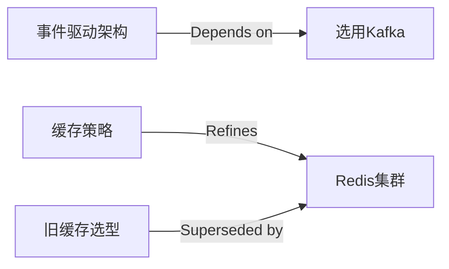

# ADR 索引模板

用于 `docs/adr/README.md`。ADR 积累到 10 份以上时启用；**新建/修改 ADR 状态时同步更新此表**（可配 CI 一致性检查告警）。

## 状态矩阵

```markdown
# ADR索引（最后更新：{YYYY-MM-DD}）

| 编号 | 标题 | 状态 | 决策日期 | 决策者 | 取代关系 |
|------|------|------|----------|--------|----------|
| ADR-001 | {标题} | ✔️ Accepted | {YYYY-MM-DD} | {团队} | → ADR-008 |
| ADR-002 | {标题} | ⚠️ Proposed | {YYYY-MM-DD} | {团队} | － |

**状态说明**：
- ⚠️ Proposed – 正在讨论，尚未决策
- ✔️ Accepted – 已通过，正在或已经实施
- ❌ Deprecated – 已弃用，不再推荐使用
- 🔚 Superseded – 已被取代，查阅取代它的ADR
```

## 决策关系图（ADR > 20 份时）



## 更新规则

- 新建 ADR、或任一 ADR 状态变更时，必须同步更新此索引表（含「取代关系」列）。
- 状态变更必须同时写入对应 ADR 内的「变更历史」表。
- 定期审查（每 6-12 个月）后更新"最后更新"日期。